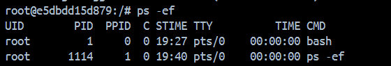
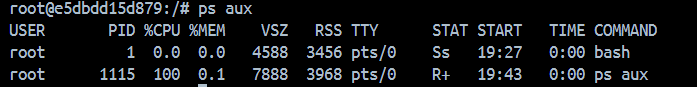
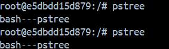
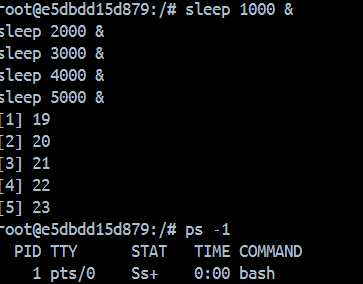
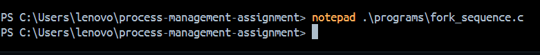
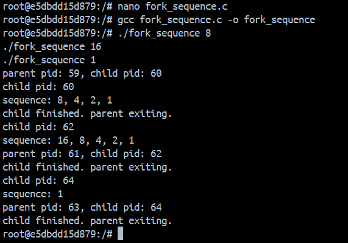
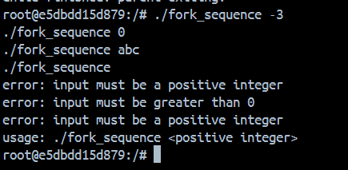
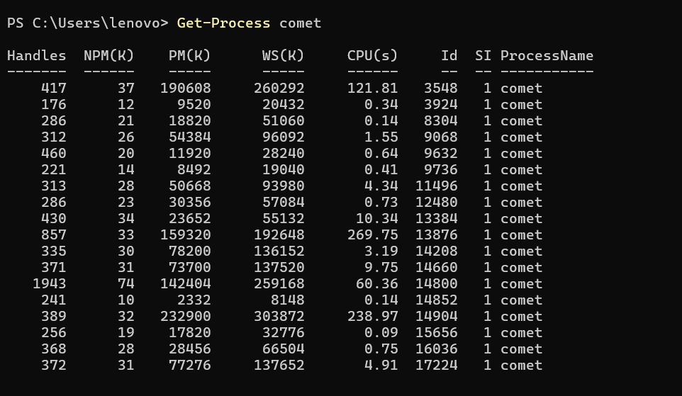

# Process Management in Linux

## Objective
- Understand process management in Linux
- Learn usage of process-related commands
- Implement process creation and synchronization using system calls

## Environment
All Linux commands were executed inside an **Ubuntu Docker container** (`proc-assignment`).
The C program was written, compiled, and run inside the same container.

---

## Task 1 — List Running Processes using `ps`

### `ps -ef`
Displays all running processes in full format. Shows UID, PID, PPID, and the command that started the process.

```
ps -ef
```



### `ps aux`
Displays all processes with CPU and memory usage in BSD format.

```
ps aux
```



---

## Task 2 — Display Process Tree using `pstree`

`pstree` shows all running processes in a tree structure, clearly showing parent-child relationships between processes.

```
pstree
```



To better demonstrate the tree structure, 5 background processes were created:

```
sleep 1000 &
sleep 2000 &
sleep 3000 &
sleep 4000 &
sleep 5000 &
```



---

## Task 3 — System Calls: fork(), wait(), exit()

### Program: fork_sequence.c

The program takes a positive integer as a command-line argument, creates a child process using `fork()`, and the child prints a sequence by repeatedly dividing the number by 2 until it reaches 1.

**Key system calls used:**
- `fork()` — creates a child process. Returns 0 to child, child's PID to parent
- `wait()` — parent waits for child to finish before exiting
- `exit()` — terminates the process and returns status to parent

```c
#include <stdio.h>
#include <stdlib.h>
#include <unistd.h>
#include <sys/wait.h>

int main(int argc, char *argv[]) {
    if (argc < 2) return 1;

    int n = atoi(argv[1]);
    pid_t pid = fork();

    if (pid == 0) {
        while (n >= 1) {
            printf("%d%s", n, (n == 1) ? "" : ", ");
            n /= 2;
        }
        printf("\n");
    } 
    else if (pid > 0) {
        wait(NULL);
    }

    return 0;
}
```

### Compilation
```
gcc fork_sequence.c -o fork_sequence
```



### Valid Inputs
```
./fork_sequence 8
./fork_sequence 16
./fork_sequence 1
```



### Invalid Inputs
```
./fork_sequence -3
./fork_sequence 0
./fork_sequence abc
./fork_sequence
```



### Explanation of Output
After `fork()` is called, two processes run concurrently — parent and child. The parent immediately calls `wait()` which blocks it until the child finishes. The child generates the sequence and calls `exit()`. Only after the child exits does the parent resume and print its final message. This demonstrates proper process synchronization.

---

## Task 4 — Find Browser PID using `top`

`top` was run on the host machine with a browser open. The browser process was identified by name and its PID was noted.

```
top
```



---

## Task 5 — Terminate Browser using `kill`

Using the PID obtained from `top`, the browser process was terminated using the `kill` command.

```
kill <PID>
```

**Before:**


**After:**


The `kill` command sends a `SIGTERM` signal (signal 15) by default, requesting the process to terminate gracefully. `kill -9` sends `SIGKILL` for forced termination.

---

## Task 6 — Change Process Priority using `nice` and `renice`

### Priority Basics
- Priority (nice value) ranges from **-20 (highest)** to **+19 (lowest)**
- `nice` sets priority when starting a new process
- `renice` changes priority of an already running process

### Before changing priorities


### Commands run
```
nice -n 10 sleep 9000 &
renice -n 5 -p <PID1>
renice -n -5 -p <PID2>
renice -n 15 -p <PID3>
```

### After changing priorities


The `NI` column in `ps -l` clearly shows the updated nice values for each process.

---

## Key Concepts Summary

| Concept | Description |
|--------|-------------|
| PID | Unique Process ID assigned to every process |
| PPID | Parent Process ID |
| fork() | Creates a child process as a copy of the parent |
| wait() | Parent blocks until child finishes |
| exit() | Terminates process and returns status |
| exec() | Replaces current process with a new program |
| nice | Priority value from -20 (high) to +19 (low) |
| SIGTERM | Default kill signal, graceful termination |
| SIGKILL | Forced termination, cannot be caught |

---

## Tools Used
- Docker (Ubuntu container)
- gcc
- ps, pstree, top, kill, nice, renice
